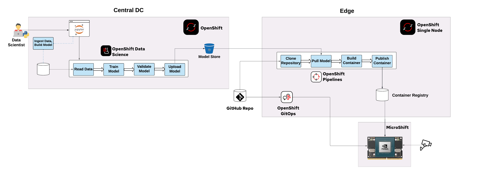
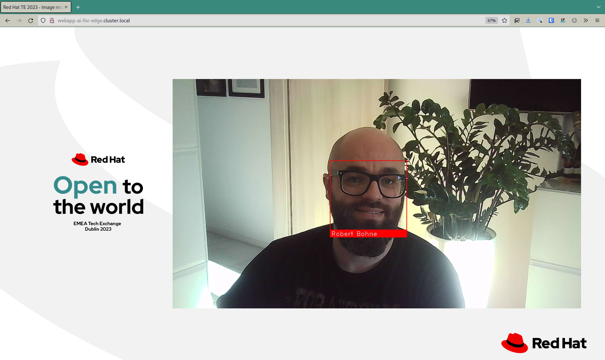

# AI at the Edge with MicroShift

This repository contains the code developed for the talk "[Image recognition on the Edge with Red Hat Device Edge (MicroShift) & Nvidia](https://docs.google.com/presentation/d/1TlnF5NKe7rwOLOIEkOpbbwJpmtJdjL5uYJUUUCsdH0k)" developed by Max Murakami and Robert Bohne based on the fantastic work of [Miguel Angel Ajo and Ricardo Noriega](https://github.com/redhat-et/AI-for-edge-microshift-demo)

The end goal of this demo is to run a face detection and face recognition AI model in a cloud-native fashion using MicroShift in an edge computing scenario. In order to do this, we used the [NVIDIA Jetson](https://www.nvidia.com/en-us/autonomous-machines/embedded-systems/) family boards (tested on Jetson Xavier NX).



This demo repository is structured into different folders/compontents:

|Compontent/Folder|Description|Required for the demo|
|---|---|---|
|`openshift-local/`|[All information to bootstrap the OpenShift Single Node or OpenShift Local enviroment. Basicly OpenShift GitOps and OpenShift Pipelines deployment and configuration.](crc-bootstrap/README.md)| Yes |
|`model-training-pipeline` |  A Jupyter notebook containing the necessary steps for training face recognition models based on facial images. | Yes |
|`local-registry-deploy/`|Registry in the edge deployed on NVidia Jetson| Yes |
|`webapp/`| Flask server that receives video streams from the cameras and performs face detection and recognition. Available via https://quay.io/rbohne/ai-for-edge-microshift-demo:webapp | Yes |
|`webapp-deploy/` | Deployment of webapp via GitOps model. | Yes |
|`container-images/cpu-only/`|CPU only base image for Python Web application, available via https://quay.io/rbohne/ai-for-edge-microshift-demo:cpu-only | No |
|`container-images/l4t-cuda-dlib/`|CUDA/GPU enabled base image for Python Web application, available via  https://quay.io/rbohne/ai-for-edge-microshift-demo:l4t-cuda-dlib | No |
|`container-images/model-container/`|Init container and data store for the model. Build during demo. Example here available:  https://quay.io/rbohne/ai-for-edge-microshift-demo:model |No |
|`model-training/`|Local model training on your laptop or jetson, just for development purpose. | No |
|`tinyproxy-for-jetson/` | [Proxy image to start a proxy server for the Nvidia Jetson.]( tinyproxy-for-jetson/README.md ) | No |

## Run the demo

### 1) Show the Web app:

http://webapp-ai-for-edge.cluster.local/

=> Nothing recognitced

### 2) Run model (re)training

1. In the RHODS dashboard, open the `model training` workbench in your Data Science Project.
2. Open the `face-images` folder. The training workflow will create an embedding for each face image with file ending `.jpg` within this folder. It will use the file name (excluding the file ending) as the name of the corresponding person. Upload new face images to this folder to train new face recognition models and thereby enable the edge application to recognize new faces.
3. Open the `training-workflow.ipynb` notebook within the `model-training-pipeline` folder of the cloned repository.
4. Open the `Object Storage Browser` JupyterLab extension in the left toolbar. Enter your S3 endpoint and credentials and log in. You should see a list of S3 buckets including the `models` bucket. Open the `models` bucket.
5. Run the notebook cells from top to bottom.
6. After executing the `Upload model to S3` cell you should see a new folder in the object storage browser. Its name indicates the timestamp (version) of the uploaded model. Within that folder, you should see the file `model.data`, which is the packaged model binary.

The ML development and training stage is concluded. In the next step we'll package the trained model into a container that can be shipped to the target edge platform.

### 3) Put the model into the container and push to edge via Pipeline:

https://console-openshift-console.apps-crc.testing/pipelines/ns/rhte-pipeline

### 4) Update the `webapp-deploy/deployment.yaml`
to use the new init container image with the updated model.

Example diff:
```diff
$ git diff webapp-deploy/deployment.yaml
diff --git a/webapp-deploy/deployment.yaml b/webapp-deploy/deployment.yaml
index 10da805..1824e47 100644
--- a/webapp-deploy/deployment.yaml
+++ b/webapp-deploy/deployment.yaml
@@ -33,7 +33,7 @@ spec:
     spec:
       serviceAccountName: privileged
       initContainers:
-      - image: default-registry.cluster.local/ai-for-edge/model:2302011505
+      - image: default-registry.cluster.local/ai-for-edge/model:2302011506
         imagePullPolicy: IfNotPresent
         name: model
         volumeMounts:
$
```

### 5) Rollout changes via OpenShift GitOps
    https://openshift-gitops-server-openshift-gitops.apps-crc.testing/applications/openshift-gitops/ai-for-edge-webapp?view=tree&resource=

### 6) Show WebApp again and now with green boxes - or at least one.

### 7) Optional: Show GPU stats via tegrastats

### Video of the Demo:

[](https://www.youtube.com/watch?v=8dHpNAPSgZ0 "AI for edge deom video")

## Set Up

The demo is set up on two OpenShift instances representing the environments of an end-to-end ML workflow:
- an OpenShift cluster for training the models and building the containers (data science environment in central data center of public cloud)
- a MicroShift instance deployed on a device in an edge location, which is connected to a camera. It hosts the AI web app, which processes the incoming video stream and performs face recognition based on the encapsulated face recognition models.

### Setting up model training and packaging on the central OCP cluster

We assume that you have set up an S3 storage instance or have write permissions on an existing S3 storage instance.

1. Install `Red Hat OpenShift Data Science` operator through the Operator Hub.
2. Install `Red Hat OpenShift Pipelines` operator (1.7 or 1.8) through the Operator Hub.
3. Deploy [manifests/face-recognition-notebook.yaml](manifests/face-recognition-notebook.yaml) into namespace `redhat-ods-applications`.
4. Open RHODS dashboard (`Red Hat OpenShift Data Science` in add-on menu in top right toolbar).
5. In the `Data Science Projects` tab, select `Create data science project`. Enter the name `demo-project` and select `Create`.
6. Select `Create workbench`:
    - Name: `model training`
    - Notebook image: `Face recognition Elyra`
    - Select `Create workbench`
7. In your S3 storage, create a bucket with name `models`.
8. In the RHODS dashboard, select `Add data connection`:
    - Name: `models`
    - AWS_ACCESS_KEY: your S3 access key
    - AWS_SECRET_ACCESS_KEY: your S3 secret key
    - AWS_S3_ENDPOINT: your S3 endpoint URL
    - AWS_S3_BUCKET: `models`
    - Connected workbench: `model training`
    - Select `Add data connection`
9. Check the status of your `model training` workbench. Once it's `Running`, select `Open`. Select `Allow selected permissions`.
10. In the workbench open the Git client from the left toolbar. Select `Clone a Repository`. Enter the URI of this repository and select `Clone`.

### Setting up OpenShift Local / OpenShift Single Node

During the demo we using OpenShift Local running on the presenter laptop

**Required:**
 * Running openshift local, follow the [officia documetation](https://developers.redhat.com/products/openshift-local/overview)


Install OpenShift GitOps & OpenShift Pipelines via:
```bash
oc apply -k openshift-local/
```

Added cluster to argocd instance

```bash
# Login into MicroShift at Nvidia Jetson
oc login -u kubeadmin https://192.168.5.5:6443/

# Login into OpenShift GitOps at OpenShift Local instance
argocd login ...

# Add cluster to argocd instance
argocd cluster add $(oc config current-context )
```

Example outpur of `argocd cluster list`:
```bash
$ argocd cluster list
SERVER                          NAME        VERSION  STATUS      MESSAGE  PROJECT
https://192.168.5.5:6443        jetson      1.21     Successful
https://kubernetes.default.svc  in-cluster
```

Apply ArgoCD Application:
```bash
oc apply -f openshift-local/ai-for-edge-webapp.application.yaml
```

Apply `push-model-to-edge-pipeline` Pipeline:
```bash
# Create project/namespace
oc new-project rhte-pipeline
oc apply -f push-model-to-edge-pipeline/buildah-with-dns.task.yaml
# You may want to adjust the defaults of S3_ENDPOINT_URL, BUCKET_NAME,
#      git_repository_url.. first
oc apply -f push-model-to-edge-pipeline/push-model-to-edge.pipeline.yaml

# Add S3 bucket access

export AWS_ACCESS_KEY=...
export AWS_SECRET_ACCESS_KEY=...

cat >credentials <<EOF
[default]
aws_access_key_id     = ${AWS_ACCESS_KEY}
aws_secret_access_key = ${AWS_SECRET_ACCESS_KEY}
EOF

oc create secret generic aws-credentials --from-file=credentials=credentials
```


### Running local proxy for the jetson

**Build**
```bash
cd tinyproxy-for-jetson/
podman build -t proxy:latest .
```

**Run**
```bash
podman run -ti --rm \
    -p 192.168.5.1:8080:8080 \
    --name proxy proxy:latest
```

### Running MicroShift (jetson L4T)

We assume that you have installed the standard L4T operating system specific to your Jetson board, and it is ready to install some packages (as root).

```
apt install -y curl jq runc iptables conntrack nvidia-container-runtime nvidia-container-toolkit
```

Disable firewalld:

```
systemctl disable --now firewalld
```

Install CRI-O 1.21 as our container runtime:

```
curl https://raw.githubusercontent.com/cri-o/cri-o/v1.21.7/scripts/get | bash

```

Configure CRI-O in order to use the NVIDIA Container Runtime


```
rm /etc/crio/crio.conf.d/*

cat << EOF > /etc/crio/crio.conf.d/10-nvidia-runtime.conf
[crio.runtime]
default_runtime = "nvidia"

[crio.runtime.runtimes.nvidia]
runtime_path = "/usr/bin/nvidia-container-runtime"
EOF

cat << EOF > /etc/crio/crio.conf.d/01-crio-runc.conf
[crio.runtime.runtimes.runc]
runtime_path = "/usr/sbin/runc"
runtime_type = "oci"
runtime_root = "/run/runc"
EOF

rm -rf /etc/cni/net.d/10-crio-bridge.conf
```

Download MicroShift binary:

```
export ARCH=arm64
export VERSION=4.8.0-0.microshift-2022-02-02-194009

curl -LO https://github.com/redhat-et/microshift/releases/download/$VERSION/microshift-linux-${ARCH}
mv microshift-linux-${ARCH} /usr/bin/microshift; chmod 755 /usr/bin/microshift
```
Create the MicroShift's systemd service:

```
cat << EOF > /usr/lib/systemd/system/microshift.service
[Unit]
Description=MicroShift
After=crio.service

[Service]
WorkingDirectory=/usr/bin/
ExecStart=/usr/bin/microshift run
Restart=always
User=root

[Install]
WantedBy=multi-user.target
EOF
```

Enable and run CRI-O and MicroShift services:
```
systemctl enable crio --now
systemctl enable microshift.service --now
```
Download and install the oc client:

```
curl -LO https://mirror.openshift.com/pub/openshift-v4/arm64/clients/ocp/stable-4.9/openshift-client-linux.tar.gz
tar xvf openshift-client-linux.tar.gz
chmod +x oc
mv oc /usr/local/bin
```

Set Kubeconfig environment variable:

```
export KUBECONFIG=/var/lib/microshift/resources/kubeadmin/kubeconfig
```

If MicroShift is up and running, after a couple of minutes you should see the following pods:

```
root@jetson-nx:~# oc get pod -A
NAMESPACE                       NAME                                  READY   STATUS    RESTARTS   AGE
kube-system                     kube-flannel-ds-7rz4d                 1/1     Running   0          17h
kubevirt-hostpath-provisioner   kubevirt-hostpath-provisioner-9m9mc   1/1     Running   0          17h
openshift-dns                   dns-default-6pbkt                     2/2     Running   0          17h
openshift-dns                   node-resolver-g4d8g                   1/1     Running   0          17h
openshift-ingress               router-default-85bcfdd948-tsk29       1/1     Running   0          17h
openshift-service-ca            service-ca-7764c85869-dvdtm           1/1     Running   0          17h

```

Now, we have our cloud-native platform ready to run workloads. Think about this: we have an edge computing optimized Kubernetes distribution ready to run an AI workload, and make use of the integrated GPU from the NVIDIA Jetson board. It's awesome!

### AI Web App

The final step is to deploy the AI Web App that will perform face detection and face recognition. This pod is basically a Flask server that will get the streams of the cameras once they are connected, and start working on a discrete number of frames.

Let's deploy the AI models on MicroShift:

```
oc new-project ai-for-edge
oc apply -f webapp.deploy.yaml
```

After few seconds:

```
oc get pods

NAME                         READY   STATUS    RESTARTS   AGE
webapp-67dd6b46fc-bqgbs   1/1     Running   2          2m33s
```

Check the hostname of the route:

```
$ oc get routes
NAME     HOST/PORT                          PATH   SERVICES   PORT       TERMINATION   WILDCARD
webapp   webapp-ai-for-edge.cluster.local          webapp     5000-tcp                 None
```

MicroShift has mDNS built-in capabilities, and this route will be automatically announced, so the cameras can register to this service, and start streaming video.

Looking at the camserver logs, we can see this registration process:

```
oc logs -f deployment/webapp -c webapp

[2022-12-30 12:24:32,647] INFO in faces: Load model from disk: /model/model.data
[2022-12-30 12:24:32,649] INFO in faces: Known faces loaded from disk.
 * Serving Flask app 'server'
 * Debug mode: off
WARNING: This is a development server. Do not use it in a production deployment. Use a production WSGI server instead.
 * Running on all addresses (0.0.0.0)
 * Running on http://127.0.0.1:5000
 * Running on http://10.85.0.9:5000
Press CTRL+C to quit
10.85.0.1 - - [30/Dec/2022 12:24:33] "GET /favicon.ico HTTP/1.1" 404 -
```

Finally, open a browser with the following URL:

```
http://webapp-ai-for-edge.cluster.local
```

This web will show you the feeds of the camera and you will be able to see how faces are detected.



## Configuration options

|Environment variable|Description|Default|RHTE 2023 Settings|Lunch&Learn Munich
|---|---|---|---|---|
|`MODEL_FILENAME`|Model to load during startup.|`model.data`|via init container|Default|
|`VIDEO_DEVICE_ID`|Video device to open:<br/>`cv2.VideoCapture(int(os.environ.get('VIDEO_DEVICE_ID', 0)),cv2.CAP_V4L2)`|`0`|`0`|`0`|
|`CAP_PROP_FRAME_WIDTH`|`cap.set(cv2.CAP_PROP_FRAME_WIDTH()`|`1280`|`800`|`800`|
|`CAP_PROP_FRAME_HEIGHT`|`cap.set(cv2.CAP_PROP_FRAME_HEIGHT()`|`720`|`600`|`600`|
|`FACE_RATIO`|Scale down the image to XX<br/>`small_frame = cv2.resize(frame, (0, 0), fx=FACE_RATIO, fy=FACE_RATIO)`|`0.25`|`1`|`1`
|`FACE_LOC_MODEL`|model – Which face detection model to use: <br/><li>`hog` is less accurate but faster on CPUs.</li><li>`cnn` is a more accurate deep-learning model which is GPU/CUDA accelerated (if available).</li>Python function [face_locations](https://face-recognition.readthedocs.io/en/latest/face_recognition.html#face_recognition.api.face_landmarks)|`hog`|`cnn`|`cnn`|
|`FACE_LOC_NTU`|**N**umber_f_**T**imes_to_**U**psample – How many times to upsample the image looking for faces. Higher numbers find smaller faces.<br/>Python function [face_locations](https://face-recognition.readthedocs.io/en/latest/face_recognition.html#face_recognition.api.face_landmarks)|`1`|`2`|`2`|
|`VIDEO_PROCESSING_FPS`|Set amount of FPS they have to capture and process.|`1`|`30`*|`1`|
|`WEB_LOGLEVEL`|Loglevel for the webapp: `CRITICAL`, `ERROR`, `WARNING`,`INFO` or `DEBUG`|`INFO`|`INFO`|`INFO`|
*) Because the setting was not available at RHTE 2023

# WebApp development at the jetson

```bash

podman run -ti --rm \
    --runtime /usr/bin/nvidia-container-runtime  \
    --net host \
    --privileged \
    -v $(pwd):/app:z \
    -e VIDEO_DEVICE_ID=0 \
    -e FLASK_APP=server \
    -e LC_ALL=C.UTF-8 \
    -e LANG=C.UTF-8 \
    -e MODEL_TRAINING_YAML=/app/model-training/data/metadata.yaml \
    -e MODEL_FILENAME=/app/model-training/model.data \
    default-registry.cluster.local/ai-for-edge/webapp:latest \
    bash

# First time train the model
root@jetson:/app# cd /app/model-training/
root@jetson:/app/model-training# ./model-training.py
Train face of Robert Bohne => /app/model-training/data/rbohne.jpg
Known faces backed up to disk: /app/model-training/model.data

# Run the Server
root@jetson:/app# cd /app/webapp/
root@jetson:/app/webapp# python3 -m flask run --host 0.0.0.0
[2022-12-30 16:45:04,064] INFO in faces: Load model from disk: model.data
[2022-12-30 16:45:04,065] CRITICAL in faces: No model face found
 * Serving Flask app 'server'
 * Debug mode: off
WARNING: This is a development server. Do not use it in a production deployment. Use a production WSGI server instead.
 * Running on all addresses (0.0.0.0)
 * Running on http://127.0.0.1:5000
 * Running on http://192.168.66.244:5000
Press CTRL+C to quit


```

## Check different versions & GPU support

|Component|Command|
|---|---|
| nvidia-l4t-core | `dpkg-query --showformat='${Version}' --show nvidia-l4t-core` |
| OpenCV | ` python3 -c 'import cv2;print(cv2.getBuildInformation())' |grep cuda ` |
| dlib | `python3 -c 'import dlib; print(dlib.DLIB_USE_CUDA);print(dlib.cuda.get_num_devices())'` |
| CUDA | `/usr/local/cuda/bin/nvcc --version` |

## Some usefull links/resources:
* <https://docs.opencv.org/4.x/d2/de6/tutorial_py_setup_in_ubuntu.html>
* <https://developer.ridgerun.com/wiki/index.php/How_to_Capture_Frames_from_Camera_with_OpenCV_in_Python>
* <https://forums.developer.nvidia.com/t/issues-with-dlib-library/72600>
* <https://catalog.ngc.nvidia.com/orgs/nvidia/containers/l4t-cuda>
* [How to setup nvidia-container-runtime and podman/runc](https://gist.github.com/bernardomig/315534407585d5912f5616c35c7fe374)
* <https://developer.nvidia.com/embedded/learn/tutorials/first-picture-csi-usb-camera>
* <https://learnopencv.com/opencv-dnn-with-gpu-support/>
* <https://medium.com/@ageitgey/build-a-hardware-based-face-recognition-system-for-150-with-the-nvidia-jetson-nano-and-python-a25cb8c891fd>
* <https://repo.download.nvidia.com/jetson/>
* <https://community.theta360.guide/t/ricoh-theta-v-livestreaming-with-jetson-xavier-ros-opencv-nuc/7105/32>
* <https://github.com/mmaaz60/SkipVideoFramesUsingOpenCV>

## Conclusion

This demo is just a simple use case of what an edge computing scenario would look like. Running AI/ML models on top of an embedded system like the Nvidia Jetson family, and leveraging cloud-native capabilities with MicroShift.

We hope you enjoy it!
