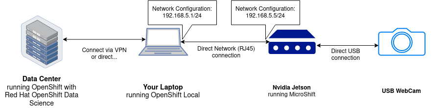

# AI at the Edge with MicroShift

本デモは、エッジコンピューティングのシナリオで、MicroShiftを使用して、クラウドネイティブなアプローチによる顔検出と顔認識AIをエッジデバイス上で実行します。
本デモでテスト済みのエッジデバイスは、[IntelNUC](https://www.intel.co.jp/content/www/jp/ja/products/details/nuc.html)と、[NVIDIA Jetson](https://www.nvidia.com/en-us/autonomous-machines/embedded-systems/)ファミリー、VirtualBox上の仮想マシンをエッジデバイスとして擬似的に利用しても動作します。

> なお、本デモは、[Miguel Angel Ajo and Ricardo Noriega](https://github.com/redhat-et/AI-for-edge-microshift-demo)のコードと、Max MurakamiとRobert Bohneがプレゼン「[Red Hat Device Edge (MicroShift) & Nvidiaによるエッジでの画像認識](https://docs.google.com/presentation/d/1TlnF5NKe7rwOLOIEkOpbbwJpmtJdjL5uYJUUUCsdH0k)」のコードをベースにしています。


リポジトリには、以下のコンテンツが含まれます。

|コンポーネント/フォルダ|概要|デモでの必要性|
|---|---|---|
|`openshift-local/`|[ラップトップにインストールしたOpenShift Single NodeまたはOpenShift.localへデプロイする、OpenShift PipelinesおよびOpenShift GitOpsのマニフェスト](crc-bootstrap/README.md)| Yes |
|`model-training-pipeline` |顔画像に基づく顔認識モデルの学習に必要なステップを含むJupyterノートブック| Yes |
|`local-registry-deploy/`|NVIDIA Jetsonで展開されるコンテナレジストリ(Docker Registry)のマニフェスト| Yes |
|`webapp/`|RTMPでカメラからのビデオストリームを受信し、顔認識を実行するFlaskサーバ　https://quay.io/yono/ai-for-edge-microshift-demo:webapp | Yes |
|`webapp-deploy/` |Webappのマニフェスト | Yes |
|`container-images/cpu-only/`|WebappのCPU環境用のコンテナベースイメージ https://quay.io/yono/ai-for-edge-microshift-demo:cpu-only | No |
|`container-images/l4t-cuda-dlib/`|WebappのCUDA/GPU対応のコンテナベースイメージ https://quay.io/yono/ai-for-edge-microshift-demo:l4t-cuda-dlib | No |
|`container-images/model-container/`|学習モデルの初期化とデータストアへの格納を行う小ンテナベースイメージ https://quay.io/yono/ai-for-edge-microshift-demo:model |No |
|`model-training/`|ラップトップやJetsonなどのローカル環境でモデル学習を行う検証用アプリ | No |

## デモの流れ

Webappが起動した状態で以下を実行します。

### 1) Webappへのアクセス

http://webapp-ai-for-edge.cluster.local/

> MicroShiftはmDNSが組み込まれてるため、上記のURLでアクセスできるはずです。

### 2) モデルの(再)学習

1. RHODSのダッシュボードで、`model training`ワークベンチを開きます。
2. `face-images`フォルダを開きます。このフォルダへ`.jpg`形式の顔画像を格納します。ファイル名は対応する人物名としてください。
3. `model-training-pipeline` フォルダ内の `training-workflow.ipynb` ノートブックを開きます。
4. 左のツールバーにある `Object Storage Browser`にてJupyter notebookを開きます。S3のエンドポイントと認証情報を入力し、ログインすると、学習モデルを格納するバケットを含むS3バケットのリストが表示されます。
5. ノートブックのセルを上から下に順番に実行します。
6. セルを実行すると、オブジェクトストレージブラウザに新しいフォルダが表示されるはずです。その名前は、アップロードされたモデルのタイムスタンプ（バージョン）を示しています。そのフォルダの中に、パッケージ化されたモデルのバイナリである `model.data` というファイルが格納されます。

これで追加された顔画像の学習は完了です。
次のステップでは、学習済みのモデルをコンテナにパッケージして、ターゲットのエッジプラットフォームに出荷できるようにします。

### 3) MLモデルをコンテナに入れ、パイプラインでエッジデバイスへPush

https://console-openshift-console.apps-crc.testing/pipelines/ns/rhte-pipeline

### 4) `webapp-deploy/deployment.yaml`をアップデート

マニフェストの`image`を再学習したモデルバージョンへ差し替えます。
ローカルでマニフェストを修正し、Gitリポジトリへpushします。

diffの例:
```diff
$ git diff webapp-deploy/deployment.yaml
diff --git a/webapp-deploy/deployment.yaml b/webapp-deploy/deployment.yaml
index 10da805..1824e47 100644
--- a/webapp-deploy/deployment.yaml
+++ b/webapp-deploy/deployment.yaml
@@ -33,7 +33,7 @@ spec:
     spec:
       serviceAccountName: privileged
       initContainers:
-      - image: default-registry.cluster.local/ai-for-edge/model:2302011505
+      - image: default-registry.cluster.local/ai-for-edge/model:2302011506
         imagePullPolicy: IfNotPresent
         name: model
         volumeMounts:
$
```

### 5) OpenShift GitOpsでロールアウト
ArgoCDがGitリポジトリとSyncして、エッジデバイスへWebappのdeloymentを差し替えます。
(デフォルトはAuto Syncにしています)

https://openshift-gitops-server-openshift-gitops.apps-crc.testing/applications/openshift-gitops/ai-for-edge-webapp?view=tree&resource=

### 6) WebAppを再び表示し、今度は緑のボックスで表示

http://webapp-ai-for-edge.cluster.local/

### デモ動画

[](https://www.youtube.com/watch?v=8dHpNAPSgZ0 "AI for edge deom video")

## ハードウェア環境のセットアップ




## デモ環境のセットアップ

デモは、3つのOpenShift環境で構成されます。

- MLモデルの学習を行うためのOpenShiftクラスタ（パブリッククラウドの中央データセンタにあるデータサイエンス環境）
- エッジデバイスにインストールされたMicroShift
- ラップトップ等にインストールされたSingle Node OpenShiftまたはOpenShift.local(エッジデバイスと同一セグメントに接続します)

### MLモデルの学習環境のセットアップ

#### 前提条件
S3インタフェースが利用できるオブジェクトストレージと、アクセスキー、シークレットアクセスキー、モデル格納用のバケットを準備します。

#### OpenShift Data Scienceのセットアップ
1. Operator Hubから`Red Hat OpenShift Data Science` operatorをインストール
2. Operator Hubから`Red Hat OpenShift Pipelines` operator (1.7 or 1.8) をインストール
3. [manifests/face-recognition-notebook.yaml](manifests/face-recognition-notebook.yaml)を`redhat-ods-applications` namespaceへデプロイ

```bash
oc apply -f manifests/face-recognition-notebook.yaml
```

4. RHODSのダッシュボードを開く (ツールバー上に追加された`Red Hat OpenShift Data Science` メニューで開けます).
5. `Data Science Projects`タブにて, `Create data science project`を選択します.そして、 名前へ`demo-project`を入力し、`Create`を押下します。
6. `Create workbench`を選択し、以下を入力
    - Name: `model training`
    - Notebook image: `Face recognition Elyra`
    - Select `Create workbench`
7. S3ストレージ内で, `models`と言う名前のバケットを作成します。
8. RHODS ダッシュボードにて, `Add data connection`を選択し、以下を入力します。
    - Name: `models`
    - AWS_ACCESS_KEY: <your S3 access key>
    - AWS_SECRET_ACCESS_KEY: <your S3 secret key>
    - AWS_S3_ENDPOINT: <your S3 endpoint URL>
    - AWS_S3_BUCKET: <your S3 Bucket name>
    - Connected workbench: `model training`
    - `Add data connection`選択します
9.  `model training` workbenchの状態を確認します。状態が`Running`となったら、`Open`を選択してください。
10. workbenchを開き、左側のツールバーから、`Git client`を選択します。そして、`Clone a Repository`を選択し、GitリポジトリのURLを指定して、`Clone`を選択してください。

### OpenShift Local / OpenShift Single Nodeのセットアップ

ラップトップへOpenShift.localをインストールします。OpenShift.localのインストール方法は以下を参照してください。

 * [officia documetation](https://developers.redhat.com/products/openshift-local/overview)


#### OpenShift PipelinesとOpenShift GitOpsのインストール
```bash
oc apply -k openshift-local/pipeline-operator
oc apply -k openshift-local/gitops-operator
```

#### OpenShift GitOpsの準備

##### ArgoCDへログイン
```bash
# OpenShift.localのOpenShift GitOpsへadmin権限でログイン
PASSWORD=$(oc get secret -n openshift-gitops openshift-gitops-cluster -o jsonpath='{.data.admin\.password}' | base64 -d)
GITOPS_SERVER=$(oc get route -n openshift-gitops openshift-gitops-server -ojsonpath='{.status.ingress[*].host}')
argocd login --username admin --password $PASSWORD $GITOPS_SERVER --insecure
```

##### MicroShiftのKubeconfigの取得
```bash
# MicroShiftのノードのIPアドレスを環境変数へ定義
export MICROSHIFT_IP=xx.xx.xx.xx

# MicroShiftのKubeconfigをローカルへコピー
ssh redhat@microshift.local sudo cat /var/lib/microshift/resources/kubeadmin/microshift.local/kubeconfig > ~/microshift.kubeconfig

# server: https://microshift.local:6443 のホスト名をIPアドレスへ修正
sed -ie "s/microshift.local/$MICROSHIFT_IP/g"  ~/microshift.kubeconfig 

# MicroShiftのKubeconfigのパスを環境変数へ定義
export KUBECONFIG=~/microshift.kubeconfig

# MicroShiftへ接続できていることを確認
oc get nodes
NAME               STATUS   ROLES                         AGE   VERSION
microshift.local   Ready    control-plane,master,worker   19h   v1.26.3
```

##### ArgoCDへMicroShiftクラスタを追加
```bash
argocd cluster add $(oc config current-context)
```

`argocd cluster list`を実行し、クラスタの登録状況を確認します。
```bash
argocd cluster list
SERVER                          NAME        VERSION  STATUS      MESSAGE                                                  PROJECT
https://xx.xx.xx.xx:6443       microshift  1.26     Successful                                                           
https://kubernetes.default.svc  in-cluster           Unknown     Cluster has no applications and is not being monitored. 
```

##### ArgoCD Applicationの作成
一度MicroShiftのKubeconfigのパスが格納された環境変数を削除します。

```bash
unset KUBECONFIG
```

ArgoCD Applicationをapplyします。

コンテナレジストリのデプロイ
```bash
cat openshift-local/registry.application.yaml | envsubst | oc apply -f -
```

nginx-rtmpのデプロイ
```bash
cat openshift-local/nginx-rtmp.application.yaml | envsubst | oc apply -f -
```

Webappのデプロイ
```bash
cat openshift-local/ai-for-edge-webapp.application.yaml | envsubst | oc apply -f -
```

##### エッジデバイス上で実行されるCRI-Oがローカルのコンテナレジストリへアクセスできるようにする
以降の手順はMicroShift側で作業します。

MicroShiftの`/etc/hosts`へローカルレジストリのURLを追記します。
```bash
echo "xx.xx.xx.xx default-registry.cluster.local" >> /etc/hosts"
```

そして、`/etc/crio/crio.conf`へ作成したローカルレジストリを`insecure registry`として追記します。
```bash
sudo su
cat /etc/crio/crio.conf
...
insecure_registries=["default-registry.cluster.local"]
...
```


CRI-Oを再起動します。
```bash
systemctl restart crio
```

#### OpenShift Pipelinesの準備

##### `push-model-to-edge-pipeline` Pipelineを作成

```bash
unset KUBECONFIG

# namespaceを作成
oc new-project rhte-pipeline
```

##### Tekton Taskを追加
```bash
cat push-model-to-edge-pipeline/buildah-with-dns.task.yaml | envsubst | oc apply -f -
```

##### MLモデルコンテナとWebappコンテナビルド用のパイプラインを作成
```bash
oc apply -f push-model-to-edge-pipeline/push-model-to-edge.pipeline.yaml
oc apply -f push-model-to-edge-pipeline/push-apps-to-edge.pipeline.yaml
```

##### S3の認証情報を追加
```bash
export AWS_ACCESS_KEY=...
export AWS_SECRET_ACCESS_KEY=...

cat >credentials <<EOF
[default]
aws_access_key_id     = ${AWS_ACCESS_KEY}
aws_secret_access_key = ${AWS_SECRET_ACCESS_KEY}
EOF

oc create secret generic aws-credentials --from-file=credentials=credentials
```


#### MicroShiftのインストール

NVIDIA JetsonへのMicroShiftのインストール方法は、以下のサイトを参照してください。

https://gitlab.com/yono1/microshift-orin-dev/-/blob/main/doc/microshift.md

#### RTMPサーバへの接続
OBSやスマホアプリなどRTMP配信できるツールを用いて、`nginx-rtmp`へアクセスします。
URLは、`nginx-rtmp`のNodePortへ以下の通り設定してください。

URL
```
rtmp://xx.xx.xx.xx:<NodePort>/live
```

ストリーミングキー
```
test
```

RTMP配信した状態で、WebappのRouteのURLへアクセスすると、配信動画がブラウザへ表示されます。


## Webappへ設定できる環境変数

|環境変数|概要|デフォルト|RHTE 2023設定|Lunch&Learn Munich
|---|---|---|---|---|
|`MODEL_FILENAME`|MLモデルのファイル名|`model.data`|init containerでパスがセットアップされます|Default|
|`VIDEO_STREAM_URL`|RTMPサーバのURL|`rtmp://nginx-rtmp:1935/live/test`|`rtmp://nginx-rtmp:1935/live/test`|`rtmp://nginx-rtmp:1935/live/test`|
|`CAP_PROP_FRAME_WIDTH`|`cap.set(cv2.CAP_PROP_FRAME_WIDTH()`|`1280`|`800`|`800`|
|`CAP_PROP_FRAME_HEIGHT`|`cap.set(cv2.CAP_PROP_FRAME_HEIGHT()`|`720`|`600`|`600`|
|`FACE_RATIO`|画像をスケールダウンさせる比率<br/>`small_frame = cv2.resize(frame, (0, 0), fx=FACE_RATIO, fy=FACE_RATIO)`|`0.25`|`1`|`1`
|`FACE_LOC_MODEL`|顔認識モデル <br/><li>`hog` はCPU上で高速に実行するモデルです</li><li>`cnn` はGPU/CUDA環境でしようします</li>Python function: [face_locations](https://face-recognition.readthedocs.io/en/latest/face_recognition.html#face_recognition.api.face_landmarks)|`hog`|`cnn`|`cnn`|
|`FACE_LOC_NTU`|**N**umber_f_**T**imes_to_**U**psample – 顔を検出するために使用する画像サンプル数 <br/>Python function: [face_locations](https://face-recognition.readthedocs.io/en/latest/face_recognition.html#face_recognition.api.face_landmarks)|`1`|`2`|`2`|
|`VIDEO_PROCESSING_FPS`|Frame per Seconds|`1`|`30`*|`1`|
|`WEB_LOGLEVEL`|Webappのログレベル: `CRITICAL`, `ERROR`, `WARNING`,`INFO` or `DEBUG`|`INFO`|`INFO`|`INFO`|

# JetsonでのWebappの開発
## Base Imageの作成

```bash
cd container-images/cpu-only
./build-and-push.sh 
```

## ローカルでPodmanを使用した起動

```bash

podman run -ti --rm \
    --runtime /usr/bin/nvidia-container-runtime  \
    --net host \
    --privileged \
    -v $(pwd):/app:z \
    -e VIDEO_DEVICE_ID=0 \
    -e FLASK_APP=server \
    -e LC_ALL=C.UTF-8 \
    -e LANG=C.UTF-8 \
    -e MODEL_TRAINING_YAML=/app/model-training/data/metadata.yaml \
    -e MODEL_FILENAME=/app/model-training/model.data \
    default-registry.cluster.local/ai-for-edge/webapp:latest \
    bash

# First time train the model
root@jetson:/app# cd /app/model-training/
root@jetson:/app/model-training# ./model-training.py
Train face of Robert Bohne => /app/model-training/data/rbohne.jpg
Known faces backed up to disk: /app/model-training/model.data

# Run the Server
root@jetson:/app# cd /app/webapp/
root@jetson:/app/webapp# python3 -m flask run --host 0.0.0.0
[2022-12-30 16:45:04,064] INFO in faces: Load model from disk: model.data
[2022-12-30 16:45:04,065] CRITICAL in faces: No model face found
 * Serving Flask app 'server'
 * Debug mode: off
WARNING: This is a development server. Do not use it in a production deployment. Use a production WSGI server instead.
 * Running on all addresses (0.0.0.0)
 * Running on http://127.0.0.1:5000
 * Running on http://192.168.66.244:5000
Press CTRL+C to quit
```

## 異なるバージョンとGPUサポートをチェック

|コンポーネント|コマンド|
|---|---|
| nvidia-l4t-core | `dpkg-query --showformat='${Version}' --show nvidia-l4t-core` |
| OpenCV | ` python3 -c 'import cv2;print(cv2.getBuildInformation())' |grep cuda ` |
| dlib | `python3 -c 'import dlib; print(dlib.DLIB_USE_CUDA);print(dlib.cuda.get_num_devices())'` |
| CUDA | `/usr/local/cuda/bin/nvcc --version` |

## 参考情報
* <https://docs.opencv.org/4.x/d2/de6/tutorial_py_setup_in_ubuntu.html>
* <https://developer.ridgerun.com/wiki/index.php/How_to_Capture_Frames_from_Camera_with_OpenCV_in_Python>
* <https://forums.developer.nvidia.com/t/issues-with-dlib-library/72600>
* <https://catalog.ngc.nvidia.com/orgs/nvidia/containers/l4t-cuda>
* [How to setup nvidia-container-runtime and podman/runc](https://gist.github.com/bernardomig/315534407585d5912f5616c35c7fe374)
* <https://developer.nvidia.com/embedded/learn/tutorials/first-picture-csi-usb-camera>
* <https://learnopencv.com/opencv-dnn-with-gpu-support/>
* <https://medium.com/@ageitgey/build-a-hardware-based-face-recognition-system-for-150-with-the-nvidia-jetson-nano-and-python-a25cb8c891fd>
* <https://repo.download.nvidia.com/jetson/>
* <https://community.theta360.guide/t/ricoh-theta-v-livestreaming-with-jetson-xavier-ros-opencv-nuc/7105/32>
* <https://github.com/mmaaz60/SkipVideoFramesUsingOpenCV>

## まとめ

このデモは、エッジコンピューティングのシナリオがどのようなものかを示す簡単なユースケースです。
Nvidia Jetsonファミリーのような組み込みシステムの上でAI/MLモデルを実行し、MicroShiftでクラウドネイティブ機能を活用します。
